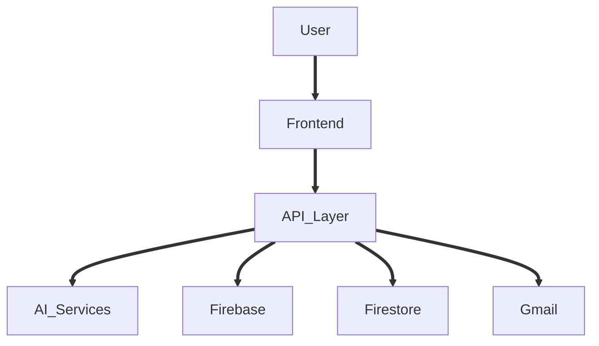

# AIRA AI

Advanced Intelligent Responsive Assistant

AIRA is a highly intelligent, voice forward personal AI assistant built for the browser. It combines instantaneous speech recognition, seamless voice synthesis, and deep tool integrations to provide a completely hands free workflow. Whether you need to search your inbox, analyze complex source code, or conduct mock interviews, AIRA acts as a dedicated companion that understands your context and executes your commands.

## Overview

The vision behind AIRA is to create a frictionless assistant that lives in your browser and interacts naturally. Rather than relying on typing and clicking, users speak directly to AIRA. The system processes the conversational intent, executes backend tools like Gmail reading or web search, and responds aloud. It is built to be fast, secure, and highly aware of the current context.

## What AIRA Can Do

AIRA features a wide array of capabilities:

* AI conversation
* Voice interaction
* Natural language interaction
* Conversation context
* Memory
* File analysis
* Text analysis
* Code analysis
* Paste Content
* Text Mode
* Code Mode
* Gmail integration
* Gmail search
* Gmail email reading
* Gmail thread reading
* Email drafting
* Email editing
* Explicit email confirmation
* Email sending
* Firebase authentication

## Core Features

AIRA delivers a polished experience focused on productivity and natural dialogue. When you speak, AIRA listens and understands your true intent. If you ask about an email, it searches Gmail. If you upload a document, it reads the document. All of these features are bound together by a memory system that remembers your preferences across different sessions.

## Voice Assistant

The voice experience is the primary way to interact with AIRA.

* Speech recognition: Captures your spoken words accurately.
* Text to speech: Reads responses back to you naturally.
* Orb interaction: A visual glowing orb indicates the current state.
* Listening and speaking states: The system strictly manages when it is listening and when it is speaking to prevent overlap.
* Interruption: You can interrupt AIRA at any time by speaking. The assistant will immediately stop talking and listen to your new command.
* Microphone interaction: Requests permissions once and manages the lifecycle gracefully.
* Echo protection: Prevents AIRA from transcribing its own voice.
* Natural conversational interaction: Speak as you would to a human.

## Gmail Intelligence

AIRA securely connects to your Gmail to manage your inbox.

* Google OAuth: Connects securely using standard OAuth flows.
* Gmail API: Uses the official API for all operations.
* Natural language email search: Say "Find the email from John" and AIRA understands.
* Email metadata: Fetches headers quickly to summarize search results.
* Full email reading: Downloads the entire message when you need details.
* MIME email handling: Parses complex email structures.
* Clean email body extraction: Removes messy HTML tags and reply chains.
* Thread understanding: Reads entire conversation threads.
* Latest message handling: Identifies the most recent message in a thread.
* Attachment metadata: Sees what files are attached to your emails.
* Search result handling: Summarizes multiple findings.
* Ambiguous result handling: Asks for clarification if multiple emails match.
* Email drafting: Composes replies based on your instructions.
* Email editing: Iteratively improves drafts if you ask for changes.
* Explicit confirmation before sending: AIRA will NEVER send an email without asking for your final approval.
* Actual Gmail sending: Delivers the drafted email through your account.
* Successful and failed send behavior: Reports the exact delivery status to you.

Sending actions require explicit confirmation from the user. The AI cannot authorize a send operation on its own.

## Memory and Context

AIRA is highly context aware and maintains both short term context and long term memory.

* Current conversation: Remembers what was said recently in the active chat.
* Long term memory: Extracts permanent facts about you and applies them to future chats.
* File context: Keeps uploaded documents in mind during the conversation.
* Gmail context: Remembers the emails it just read to you.
* Follow up questions: You can ask "What did he mean by that?" and AIRA knows who "he" is.
* Cross conversation memory: Your preferences persist even if you start a new chat.
* New conversation behavior: Starting a new chat clears temporary context but keeps your persistent memory intact.

Temporary context is cleared when you refresh or start a new thread, while persistent memory is saved to the database.

## File and Code Intelligence

You can easily provide documents or code for AIRA to analyze. 

* Paste Content: A dedicated modal allows you to paste large blocks of information.
* Text Mode: Optimized for reading articles, essays, and general text.
* Code Mode: Optimized for analyzing source code, finding bugs, and explaining logic.

After submitted content is processed, AIRA will notify you. You can then tap the orb to discuss the content through the normal conversation experience.

## Authentication and Privacy

AIRA ensures your data is protected.

The application uses Firebase authentication to verify your identity. All backend requests require server side authentication verification to ensure that the person making the request is actually logged in. User isolation is strictly enforced, meaning your data, chat history, and Gmail tokens are completely separated from other users. Sensitive credentials are handled securely and never exposed to the client.

## Technology Stack

<table>
  <tr>
    <th>Category</th>
    <th>Technology</th>
  </tr>
  <tr>
    <td>Frontend</td>
    <td>React, Vite, Framer Motion, Tailwind CSS</td>
  </tr>
  <tr>
    <td>Backend Layer</td>
    <td>Vercel Serverless Functions, Node JS</td>
  </tr>
  <tr>
    <td>Database</td>
    <td>Cloud Firestore</td>
  </tr>
  <tr>
    <td>Identity</td>
    <td>Firebase Authentication, Google OAuth</td>
  </tr>
  <tr>
    <td>AI Models</td>
    <td>Groq Inference API</td>
  </tr>
  <tr>
    <td>APIs</td>
    <td>Gmail API</td>
  </tr>
</table>

## Architecture

AIRA uses a decoupled architecture to ensure speed and security.

The User interacts with the React Frontend. The Frontend sends voice transcripts to the Vercel API layer. The API layer authenticates the request with Firebase, reads memory from Firestore, queries AI services for intent, interacts with Gmail if requested, and returns a response.

## Project Structure

The repository is organized into distinct areas:

* src: Contains all React components, views, hooks, and client side logic.
* api: Contains the Vercel serverless functions that act as the backend.
* docs: Contains the detailed documentation for the project.
* public: Contains static assets and icons.

## Getting Started

To run AIRA locally, follow these steps:

1. Ensure you have Node JS installed.
2. Clone the repository to your local machine.
3. Run `npm install` to download dependencies.
4. Set up your environment configuration using your Firebase and Google API credentials.
5. Run `npm run dev` to start the local development server.

## Security

Security is a foundational element of the AIRA architecture.

* Firebase authentication verifies user identity.
* Server side identity verification ensures API requests are legitimate.
* User data isolation prevents cross account access.
* OAuth protection keeps Gmail access secure.
* Secure token storage is utilized for user credentials.
* Encrypted sensitive credentials protect refresh tokens in the database.
* OAuth state protection prevents request forgery.
* Explicit confirmation is required for Gmail side effects.
* Protection against false AI claims ensures the LLM cannot fake a completed action.

While strong measures are in place, users should always exercise caution when connecting personal accounts.

## Collaboration

If you are interested in collaborating on AIRA, contributing features, improving the system, or discussing integrations, please contact the developer.

## License and Usage

The AIRA source code, architecture, UI, visual design, branding, concepts, and other original project materials are protected.

Without explicit written permission from the developer, the following are not permitted:

* Copying the source code
* Redistributing the source code
* Reusing substantial portions of the source code
* Using the code in another project
* Copying or reproducing the UI
* Copying or reproducing the visual design
* Copying the AIRA branding
* Creating derivative versions based on the project
* Using the project or its design commercially

Viewing the repository does not grant permission to copy, reproduce, redistribute, modify, or reuse the code or design. Collaboration or authorized reuse requires permission from the developer.

## Developer

Developed by [Harsh Shrivastava](https://github.com/Harsh%2DShrivastava1).

## Acknowledgment

AIRA is an ongoing personal software project exploring the boundaries of voice interfaces and AI. It is made possible by excellent technologies like React, Firebase, Groq, and the Gmail API.
