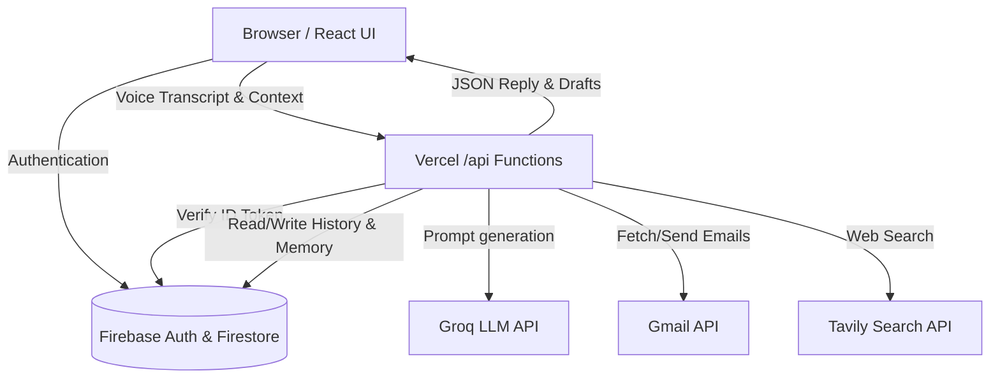

# Architecture

AIRA uses a modern, decoupled Serverless + React architecture.

## Overview Diagram

## Frontend Responsibilities
- **UI/UX**: React 19, Framer Motion for animations.
- **Voice Engine**: Uses native Web Speech APIs (`SpeechRecognition` and `speechSynthesis`). The `useVoice` hook acts as a strict state machine (idle, listening, thinking, speaking) to prevent audio feedback and handle user barge-in.
- **State Management**: React state handles chat history visually, while `useFirestore` syncs to the database.

## Serverless Layer (`/api`)
- **Stateless Execution**: Hosted on Vercel as Node.js serverless functions.
- **Authentication Boundary**: Every route expects an `Authorization: Bearer <Firebase-ID-Token>` header.
- **Orchestration**: Routes like `/api/chat` determine user intent (e.g., standard chat, web search, Gmail action) and invoke the necessary `_lib` services.

## External Integrations
- **Firebase/Firestore**: User profiles, encrypted Gmail tokens, chat threads, and extracted memory snippets.
- **Groq**: Provides low-latency inference. AIRA utilizes automated failover between multiple keys (`GROQ_API_KEY_1`, `GROQ_API_KEY_2`).
- **Gmail**: Accessed securely via server-side OAuth2. The `gmailService.js` handles API requests on behalf of the user.

## Data Flow (Voice Request)
1. User speaks. `useVoice` captures the final transcript.
2. Frontend POSTs transcript to `/api/chat` with conversation context.
3. `/api/chat` fetches persistent memory and recent thread history from Firestore.
4. If a Gmail intent is detected, `emailHelper.js` formats a structured parameter search, fetches Gmail data via `gmailService.js`, and injects it into the LLM context.
5. Groq returns a JSON response containing the text reply and optionally an email draft object.
6. Frontend adds the reply to the chat UI and synthesizes the speech.
